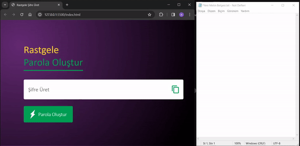

# Rastgele Şifre Üret

Bu proje, kullanıcıların güçlü ve rastgele şifreler oluşturmasına yardımcı olan basit bir web uygulamasını içerir. Şifre oluşturucu, büyük harfler, küçük harfler, rakamlar ve semboller içeren karmaşık şifreler üretir. Ayrıca, kullanıcılar oluşturulan şifreyi hızlıca kopyalayabilirler.

## Özellikler

- 12 karakter uzunluğunda rastgele şifreler oluşturur.
- Büyük harfler, küçük harfler, rakamlar ve semboller içerir.
- Kopyala butonu ile şifreyi panoya kopyalama özelliği.

## Kullanılan Teknolojiler

- HTML, CSS ve JavaScript kullanılarak geliştirildi.
- Basit ve etkili algoritmalar kullanılarak şifre oluşturma işlemi gerçekleştirildi.

## Nasıl Kullanılır?

1. Proje dosyalarını bilgisayarınıza indirin.
2. `index.html` dosyasını bir web tarayıcısı ile açın.

## Nasıl Katkıda Bulunabilirim?

1. Fork (çatallama) butonunu kullanarak projeyi kendi GitHub hesabınıza kopyalayın.
2. Değişiklikleri yapın ve commit'leyin.
3. Kendi hesabınızdan Pull Request (çekme isteği) gönderin.

## Ekran Görüntüsü

